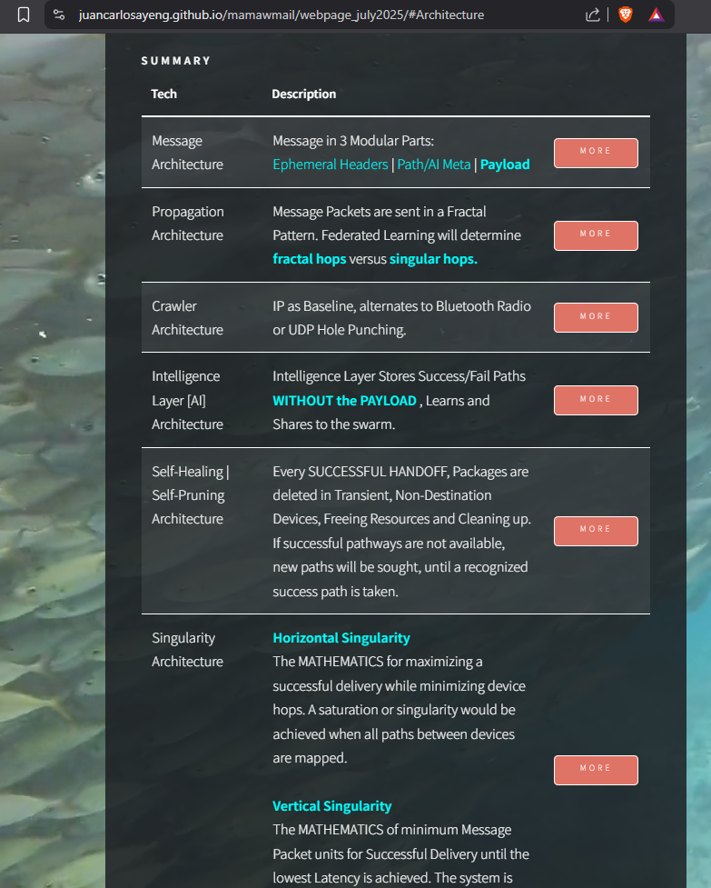

# WHATS NEW?
<br>
 

## SUMMARY
July 20 2025

# Fractal Macro AI + Fractal Micro AI [Multi-Level AI]
> ### 1. Swarm-Level [System-Wide]
> ### 2. Device-Level [Device AI]


## A. Swarm-Level AI
MAMAWMAIL's decentralized network doesn't rely on one central AI. Instead, intelligence emerges from a swarm of devices: Micro AI handles routing and trust per device, while Macro AI learns across the entire swarm to guide propagation, optimize delivery, and control fractal behavior.
Monitors System of Devices, their info and knowledge of aggregated pathway lessons. Optimization for message success rate vs network load.

This architecture merges local autonomy and global learning into a self-improving system.


Swarm-Level AI can adjust:

> #### 1. Propagation Radius;
> #### 2. Max Fractal Hops per device, Start Singular Hops;
> #### 3. Grouping/Clustering, and other macro-level management;


## B. Device-Level AI
MAMAWMAIL's Device-Level AI Agent on each device [mainly] a lightweight scoring function.
Learns:

> #### 1. Best neighbors for routing.
> #### 2. Local traffic conditions. [Crawler AI]
> #### 3. Success/failure of past hops.

Output:
> #### 1. Propagation Control: Crawler 'Been Here' Packet Acceptance/Rejection
> #### 2. Transmit / Handoff Logic
> #### 3. Retrieval, Incorporation of System Learned Pathways


## AI Architecture Comparison: Gemini vs. MAMAWMAIL

While Google Gemini AI powers centralized, cloud-based intelligence for search tasks, **MAMAWMAIL** operates on a radically different model — a decentralized swarm where intelligence is distributed. Here's a side-by-side breakdown of how each system handles core AI components:

| **Component**       | **Google Gemini AI**                | **MAMAWMAIL AI Layer**                       |
|---------------------|-------------------------------------|----------------------------------------------|
| **Query Parsing**   | LLM on server                       | Micro AI classifies message priority         |
| **Context Awareness**| Gemini contextualizes search       | Micro AI analyzes device context             |
| **Synthesis**       | Gemini composes direct answer       | Macro AI guides swarm routing                |
| **Learning Loop**   | Feedback from user queries          | Feedback from packet delivery stats          |

In essence, **Gemini** operates as a cloud monolith with powerful but centralized intelligence. **MAMAWMAIL** flips the model: by embedding local learning into each node and coordinating behavior swarm-wide, it creates emergent intelligence without centralized servers.

This shift from **cloud AI** to **edge-swarmed AI** marks a foundational innovation in decentralized messaging and infrastructure resilience.


<hr>
 
# Summary
July 18 2025<br>

initial webpage design, ui and ux...ongoing
<br>
https://juancarlosayeng.github.io/mamawmail/
<br>

<br><br>
<p align="center">
  
</p>


<hr>
July 13 2025

> ## SUMMARY

1. Identified, selected and informed initial TEAM Members;
2. Finalized System Architecture;
3. Creating and finishing Architecture Animations;
4. Creating and Finishing Github Website;
5. Mamawmail Packet Design, Preprocess, Handoff, Handshake, Return Trail Algorithm;
6. Web presence;
<ul>
  <li>[Facebook](https://www.facebook.com/profile.php?id=61577966164619&sk=about)</li>
  <li>[X](https://x.com/AyengJuan78960)</li>
  <li>[Youtube](https://www.youtube.com/@buhaykamatis1244)</li>
</ul>


> ## ARCHITECTURE
[Pre-Alpha] : More on Website. This system is what makes Mamawmail different, censorship-free, disasater-resilient, anonymous
> ### 1. Message Architecture
> ### 2. Propagation Architecture
> ### 3. Crawler Architecture
> ### 4. Intelligence Layer [AI] Architecture
> ### 5. Self-Healing | Self-Pruning Architecture
> ### 6. Singularity Architecture [MATH]
> ### 7. Privacy Architecture
Thank you JC Ayeng

<hr>
<br><br><br><br>
<hr>

> # MAMAWMAIL: An AI-Assisted Decentralized Messaging Protocol Using Fractal Propagation

## 📘 Abstract

**MAMAWMAIL** is a decentralized, peer-to-peer messaging protocol that delivers encrypted messages without central servers or permanent infrastructure.  
Using a fractal propagation model, messages branch through nearby devices and self-clean upon successful delivery. It integrates lightweight routing intelligence and prepares for optional AI-based learning to optimize delivery paths over time.

MAMAWMAIL is designed to be censorship-resistant, infrastructure-free, and suitable for use in disaster zones, offline environments, and sensitive field operations.

This repository contains the **source code implementation** of the protocol engine.

> 📘 Whitepaper, architecture rationale, and grant documentation:  
> https://github.com/juancarlosayeng/mamawmail-whitepaper

---

## 🎯 Project Goals

- Enable secure, serverless messaging using local device relays (Bluetooth, Wi-Fi Direct, UDP)
- Create a propagation system that is self-pruning, resilient, and scalable
- Add lightweight peer learning to improve routing over time
- Support future extensions like group messaging and swarm optimization
- Provide a modular open-source reference for mesh-based communication systems

---

## ✨ Key Features

- Fractal message propagation (3-way hops, 5-depth maximum or configurable)
- Self-cleaning message trails after successful delivery
- Local peer scorecard and memory optimization (SQLite)
- Optional AI-assisted routing (plugin-based: GNN, heuristics, etc.)
- Encrypted, end-to-end peer-to-peer delivery
- Plugin architecture for simulation, tracing, fleet control

---

## 📦 Use Cases

- Disaster zone communication without signal
- Military field coordination in disconnected areas
- Censorship resistance in restricted networks
- Messaging inside factories, ships, or campuses
- Educational use for decentralized learning and AI swarm modeling

---

## 🗂 Directory Overview

```text
mamawmail/
├── core/              # Main protocol components
│   ├── swarm_engine/  # Relay logic (e.g., relay_manager.py)
│   ├── encryption/    # E2E cryptography layer
│   ├── feedback/      # Handles receipts and cleanup
│   ├── ledger/        # Path memory via local SQLite
│   ├── ui/            # Console interface
│   └── config/        # System configuration
│
├── plugins/           # Optional AI, tracing, visual, enterprise tools
├── scripts/           # Bootstrap tools and CLI
├── tests/             # Unit and integration test cases
├── docs/              # Developer documentation
│   ├── architecture.md
│   ├── install_guide.md
│   └── plugin_specs/
└── README.md
```

---


## 📄 License
### 1. Source Code:
- Licensed under the MIT License — free for commercial and personal use.

### 2. Protocol & Documentation:
- See the mamawmail-whitepaper repo.
- Protocol design is AGPLv3; documentation is CC BY-NC-ND 4.0.

### 3. Commercial Use:
- Use of MAMAWMAIL or IFPProtocol in enterprise, military, or branded deployments requires a commercial license.
- The name, icon, and "MAMAWMAIL" trademark are not open source.

📩 For licensing inquiries: jcgayeng@protonmail.com


## 🧠 IFPProtocol – Intelligent Fractal Propagation Protocol
** Author: Engr. Juan Carlos G. Ayeng
** First Published: June 25, 2025
** Repository: mamawmail
** Whitepaper: mamawmail-whitepaper

Definition
The Intelligent Fractal Propagation Protocol (IFPProtocol) is the core relay system that powers MAMAWMAIL. It enables:

- Recursive 3-way branching with a default 5-hop maximum
- "Been-here" tagging to avoid circular delivery
- Success-based deletion and pruning of old paths
- Optional integration with AI-based peer scoring
- Designed for disconnected and infrastructure-hostile environments.

## 🤝 Contributions
We welcome testers, peer-to-peer developers, offline-first engineers, and mesh networking researchers.
Please open issues, submit pull requests, or share test scenarios and datasets.

## ✍️ Citation
** Author: Engr. Juan Carlos G. Ayeng
** 📄 Whitepaper: MAMAWMAIL: A Fractal, Serverless, Self-Optimizing Communication Protocol
** © 2025. All rights reserved.


